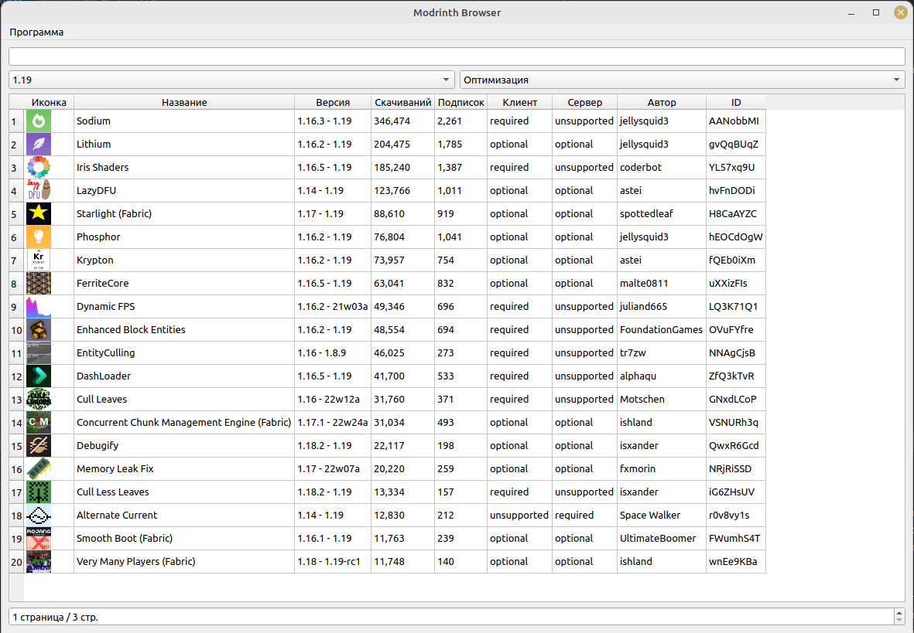

## ModrinthBrowser
Программа для быстрой установки Minecraft модов с сайта [Modrinth](https://modrinth.com/)

Программа написана на PyQt5 за несколько дней :)

### Настройки

В настройках Вы можете быстро изменить путь к папке с игрой. 
Программа ищет папку с игрой, а также папки сборок MultiMC.

